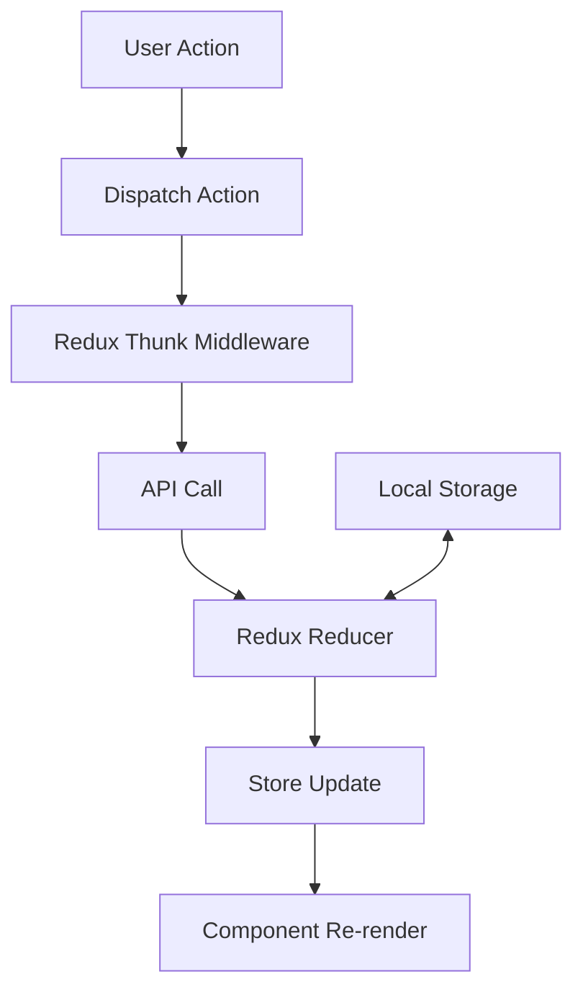
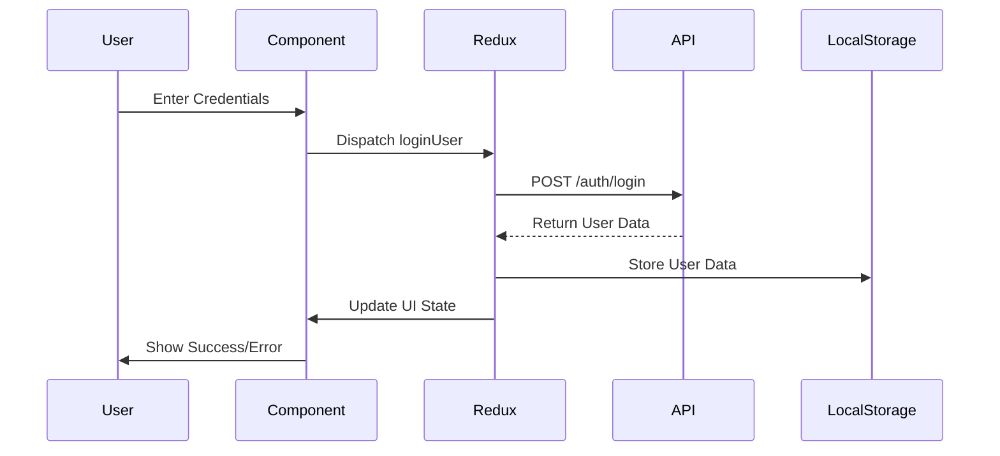
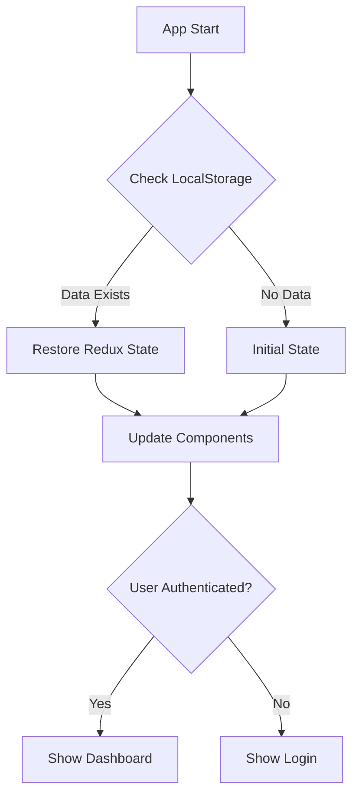
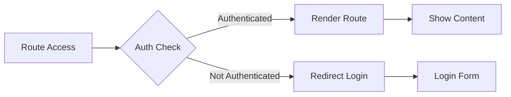
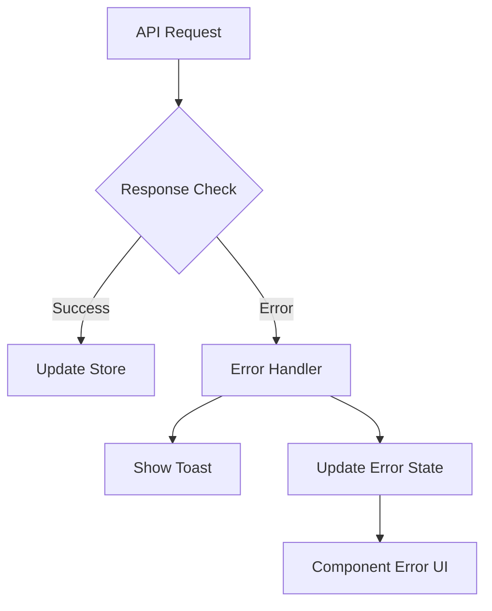
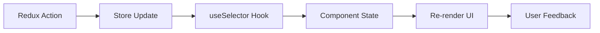

# CUH Portal - Redux Implementation Documentation

## Table of Contents
1. [Redux Core Flow](#redux-core-flow)
2. [Authentication Flow](#authentication-flow)
3. [Data Persistence Flow](#data-persistence-flow)
4. [Route Protection Flow](#route-protection-flow)
5. [Error Handling Flow](#error-handling-flow)
6. [Component Update Cycle](#component-update-cycle)

## Redux Core Flow



### Explanation
1. **User Action**: User interacts with the UI (e.g., clicks login button)
2. **Dispatch Action**: Component dispatches an action (e.g., loginUser)
3. **Redux Thunk**: Middleware intercepts action for async operations
4. **API Call**: Makes HTTP request to backend
5. **Reducer**: Updates state based on API response
6. **Store Update**: Redux store gets new state
7. **Re-render**: Components using the state update

### Implementation Example
```typescript
// Component dispatching action
const handleLogin = async () => {
    try {
        await dispatch(loginUser(credentials)).unwrap();
        router.push('/dashboard');
    } catch (error) {
        toast.error(error.message);
    }
};
```

## Authentication Flow



### Explanation
1. **User Input**: User enters email and password
2. **Form Submission**: Component captures data and dispatches action
3. **API Request**: Redux thunk makes authenticated request
4. **Response Handling**: Success/failure processing
5. **State Update**: Store user data and update UI
6. **Persistence**: Save to localStorage for session management

### Implementation Example
```typescript
// Auth Slice Configuration
const authSlice = createSlice({
    name: 'auth',
    initialState,
    reducers: {
        logout: (state) => {
            state.user = null;
            localStorage.removeItem('user');
        }
    },
    extraReducers: (builder) => {
        builder
            .addCase(loginUser.fulfilled, (state, action) => {
                state.user = action.payload.data;
                state.loading = false;
            })
    }
});
```

## Data Persistence Flow



### Explanation
1. **App Initialization**: Application loads and checks storage
2. **State Check**: Verify if previous session exists
3. **State Restoration**: Load saved state if available
4. **Route Decision**: Direct user based on auth state
5. **UI Update**: Show appropriate interface

### Implementation Example
```typescript
// Auth Initializer Component
export default function AuthInitializer() {
    const dispatch = useAppDispatch();

    useEffect(() => {
        const userData = localStorage.getItem('user');
        if (userData) {
            dispatch(restoreAuth(JSON.parse(userData)));
        }
    }, []);

    return null;
}
```

## Route Protection Flow



### Explanation
1. **Route Request**: User attempts to access protected route
2. **Auth Verification**: Check if user is authenticated
3. **Access Control**: Allow/deny based on auth state
4. **Redirection**: Send to appropriate page
5. **Content Display**: Show requested content if authorized

### Implementation Example
```typescript
// Protected Route Component
function ProtectedRoute({ children }) {
    const { user } = useAppSelector(state => state.auth);
    const router = useRouter();

    useEffect(() => {
        if (!user) {
            router.push('/login');
        }
    }, [user]);

    return user ? children : null;
}
```

## Error Handling Flow



### Explanation
1. **Request Initiation**: Start API call
2. **Response Validation**: Check for success/failure
3. **Error Processing**: Handle various error types
4. **User Feedback**: Display error messages
5. **State Update**: Update error state in store
6. **UI Update**: Show error in components

### Implementation Example
```typescript
// Error Handling in Thunk
export const loginUser = createAsyncThunk(
    'auth/loginUser',
    async (credentials, thunkAPI) => {
        try {
            const response = await axios.post('/api/login', credentials);
            return response.data;
        } catch (error) {
            return thunkAPI.rejectWithValue({
                message: error.response?.data?.message || 'Login failed'
            });
        }
    }
);
```

## Component Update Cycle



### Explanation
1. **Action Dispatch**: Trigger state change
2. **Store Processing**: Update global state
3. **Hook Selection**: Components select needed state
4. **Local Update**: Component receives new state
5. **UI Refresh**: Re-render with new data
6. **User Interface**: Show updated content

### Implementation Example
```typescript
// Component with Redux State
function DashboardComponent() {
    const { user, loading, error } = useAppSelector(state => state.auth);
    const dispatch = useAppDispatch();

    useEffect(() => {
        if (error) {
            toast.error(error);
        }
    }, [error]);

    return (
        <div>
            {loading ? (
                <LoadingSpinner />
            ) : (
                <UserInfo user={user} />
            )}
        </div>
    );
}
```

## Best Practices and Recommendations

1. **State Management**
   - Keep state normalized
   - Use TypeScript for type safety
   - Implement proper error handling
   - Maintain loading states

2. **Security**
   - Implement JWT authentication
   - Use HTTP-only cookies
   - Add CSRF protection
   - Handle token refresh

3. **Performance**
   - Memoize selectors
   - Optimize re-renders
   - Handle cleanup properly
   - Implement proper loading states

4. **User Experience**
   - Show loading indicators
   - Provide error feedback
   - Maintain consistent state
   - Handle edge cases

## Future Enhancements

1. **Authentication**
   - Session timeout handling
   - Remember me functionality
   - Multi-factor authentication
   - Password reset flow

2. **State Management**
   - Offline support
   - State persistence options
   - Better error recovery
   - Action logging

3. **Security**
   - Role-based access control
   - API request throttling
   - Enhanced error handling
   - Security headers 